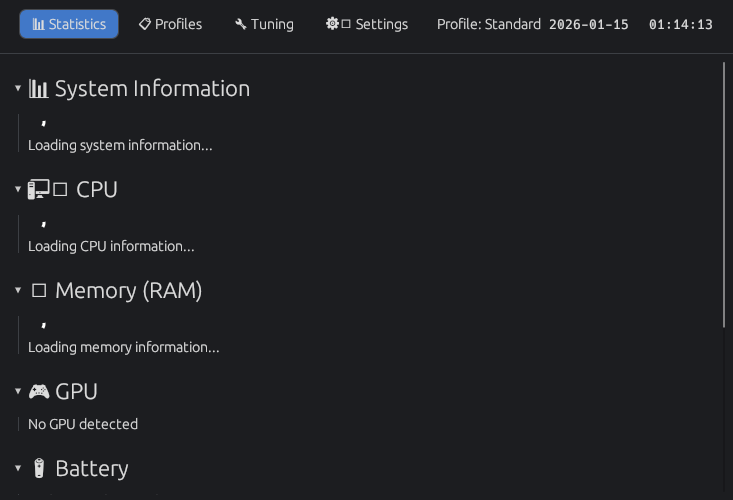
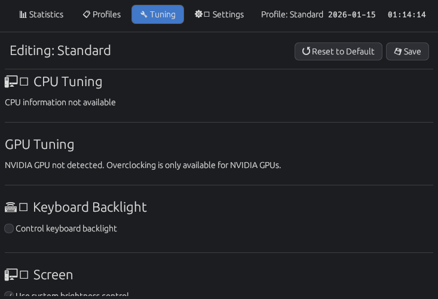
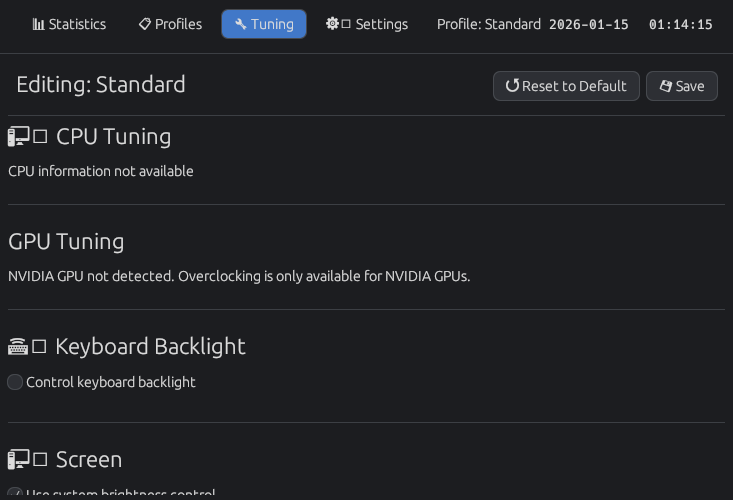

# LapSphere

LapSphere is a powerful hardware control and monitoring application designed specifically for Uniwill and Clevo laptops. It provides a comprehensive interface for managing various hardware aspects, from CPU performance and GPU overclocking to keyboard lighting and fan curves.

## Features

- **Performance Profiles**: Create and switch between custom profiles to quickly adapt your hardware settings to different tasks.
- **CPU Control**:
  - Manage scaling governors (Schedutil, Performance, Powersave, etc.).
  - Toggle Turbo Boost and SMT (Simultaneous Multithreading).
  - Set TDP (Thermal Design Power) limits (PL1, PL2, PL4).
  - Adjust Energy Performance Preference (EPP).
  - Configure minimum and maximum frequency limits.
- **GPU Tuning (NVIDIA)**:
  - Overclocking with core and memory clock offsets.
  - Adjust power limits.
  - Set locked clock values for stable performance.
  - Manual fan control for supported desktop-class GPUs.
  - Real-time VRAM information (type, vendor, bandwidth).
- **Keyboard Lighting**:
  - Control RGB backlighting for various keyboard types (Single-zone, Multi-zone, Per-key RGB).
  - Apply effects like Breathe, Cycle, Dance, Flash, and Wave.
  - Adjust brightness and speed.
- **Fan Management**:
  - Create custom fan curves for different temperature targets.
  - Switch between Auto and Manual fan modes.
- **Battery Health**:
  - Set custom charge start and end thresholds to prolong battery lifespan.
- **Comprehensive Monitoring**:
  - Real-time statistics for CPU, GPU, Memory, Battery, WiFi, Storage, and Fans.
  - Gamepad connection and battery status tracking.
- **System Logs**: Built-in log viewer to monitor application and daemon activity.

## Architecture

LapSphere follows a client-server architecture to securely manage hardware settings that require elevated privileges:

- **`lapsphere-daemon`**: A background service running with root privileges. It interacts directly with hardware interfaces (sysfs, NVML, ioctls) and exposes a secure D-Bus interface.
- **`lapsphere` (GUI)**: A user-friendly graphical interface built with `egui`. It communicates with the daemon over D-Bus to fetch statistics and apply settings.
- **`common`**: A shared library containing data structures and types used by both the daemon and the GUI.

## Screenshots

| Statistics | Tuning |
| :---: | :---: |
|  |  |

| Settings | Hardware Info |
| :---: | :---: |
|  |  |

## Installation

### Arch Linux

LapSphere is available on Arch Linux via the provided `PKGBUILD`.

1. Clone the repository.
2. Run `makepkg -si` in the root directory.

### Building from Source

Ensure you have Rust and Cargo installed, along with the necessary dependencies: `dbus`, `polkit`, `libxkbcommon`, `dmidecode`, `pciutils`, `ethtool`, `iw`, `gtk3`, `libadwaita`.

```bash
cargo build --release
```

The binaries will be located in `target/release/lapsphere` and `target/release/lapsphere-daemon`.

## Usage

After installation, the daemon should be started as a system service.

```bash
# To start the GUI
lapsphere

# To start the GUI minimized to tray
lapsphere --tray
```

## License

This project is licensed under the GPL-2.0 License - see the [LICENSE](LICENSE) file for details.
